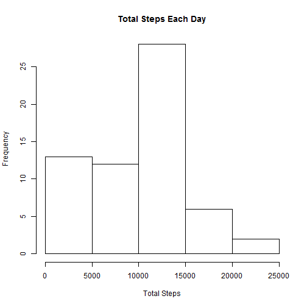
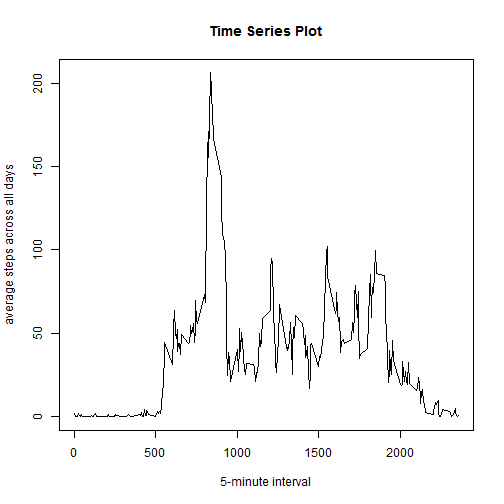
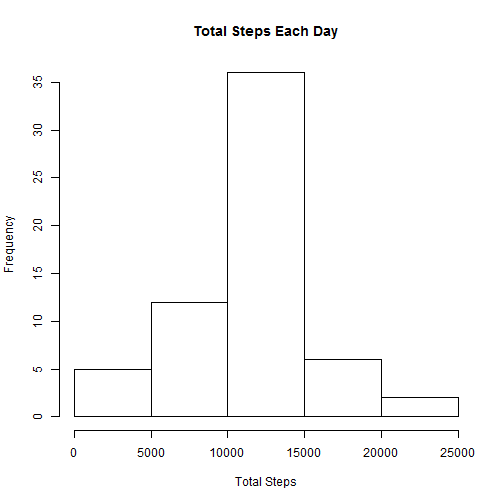

## Loading and preprocessing the data.

```r
mydata <- read.csv("activity.csv")
str(mydata)
```

```
## 'data.frame':	17568 obs. of  3 variables:
##  $ steps   : int  NA NA NA NA NA NA NA NA NA NA ...
##  $ date    : Factor w/ 61 levels "2012-10-01","2012-10-02",..: 1 1 1 1 1 1 1 1 1 1 ...
##  $ interval: int  0 5 10 15 20 25 30 35 40 45 ...
```
  
## What is mean total number of steps taken per day?
Calculate the total number of steps taken per day. The NAs are ignored.

```r
day.total <- lapply(split(mydata$steps, mydata$date), sum, na.rm = TRUE)
```

Make a histogram of the total number of steps taken each day.

```r
library(reshape)
day.total <- melt(day.total)
day.total <- rename(day.total, c(L1 = "date"))
hist(day.total$value, main = "Total Steps Each Day", xlab = "Total Steps")
```

 

Calculate and report the mean and median of the total number of steps taken per day.

* the mean of the total number of steps taken per day

```r
mean(day.total$value)
```

```
## [1] 9354.23
```
* the median of the total number of steps taken per day

```r
median(day.total$value)
```

```
## [1] 10395
```

## What is the average daily activity pattern?
Make a time series plot (i.e. type = "l") of the 5-minute interval (x-axis) and the average number of steps taken, averaged across all days (y-axis). The NAs are ignored.

```r
time.series <- lapply(split(mydata$steps, mydata$interval), mean, na.rm = TRUE)
time.series <- melt(time.series)
time.series <- rename(time.series, c(L1 = "interval"))
plot(time.series$interval, time.series$value, type = "l", xlab = "5-minute interval", ylab = "average steps across all days", main = "Time Series Plot")
```

 

Which 5-minute interval, on average across all the days in the dataset, contains the maximum number of steps?

```r
time.series[which.max(time.series$value), "interval"]
```

```
## [1] "835"
```

## Imputing missing values
Calculate and report the total number of missing values in the dataset (i.e. the total number of rows with NAs)

```r
nrow(mydata)-nrow(mydata[complete.cases(mydata), ])
```

```
## [1] 2304
```

Devise a strategy for filling in all of the missing values in the dataset. The mean for that 5-minute interval is used to fill the NAs.

Create a new dataset that is equal to the original dataset but with the missing data filled in.

```r
my.newdata <- mydata
for(i in 1:nrow(my.newdata)) {
        if(is.na(my.newdata[i, "steps"])) {
                my.newdata[i, "steps"] <- 
                        time.series[which(time.series$interval == my.newdata[i, "interval"]), "value"]
        }
}
```

Make a histogram of the total number of steps taken each day and Calculate and report the mean and median total number of steps taken per day.

```r
day.total2 <- lapply(split(my.newdata$steps, my.newdata$date), sum)
day.total2 <- melt(day.total2)
day.total2 <- rename(day.total2, c(L1 = "date"))
hist(day.total2$value, main = "Total Steps Each Day", xlab = "Total Steps")
```

 

* the mean of total number of steps taken per day

```r
mean(day.total2$value)
```

```
## [1] 10766.19
```
* the median of total number of steps taken per day

```r
median(day.total2$value)
```

```
## [1] 10766.19
```

These values differ from the estimates from the first part of the assignment. Imputing missing data increases the estimates of the total daily number of steps.

## Are there differences in activity patterns between weekdays and weekends?
For this part the weekdays() function is utilized. Use the dataset with the filled-in missing values for this part.

Create a new factor variable in the dataset with two levels - "weekday" and "weekend" indicating whether a given date is a weekday or weekend day.

```r
my.newdata$day_type <- vector(mode = "character", length = nrow(my.newdata))
my.newdata$date <- as.Date(my.newdata$date)
for(i in 1:nrow(my.newdata)) {
        if(weekdays(my.newdata[i, "date"]) == "Saturday" || weekdays(my.newdata[i, "date"]) == "Sunday") {
                my.newdata[i, "day_type"] <- "weekend"
        } else {
                my.newdata[i, "day_type"] <- "weekday"
        }
}
my.newdata$day_type <- as.factor(my.newdata$day_type)
```

Make a panel plot containing a time series plot (i.e. type = "l") of the 5-minute interval (x-axis) and the average number of steps taken, averaged across all weekday days or weekend days (y-axis). 

```r
time.series2 <- aggregate(steps ~ interval + day_type, data = my.newdata, mean)
library(lattice)
xyplot(steps ~ interval | day_type, time.series2, type = "l", layout = c(1, 2), 
       xlab = "Interval", ylab = "Number of steps")
```

 
